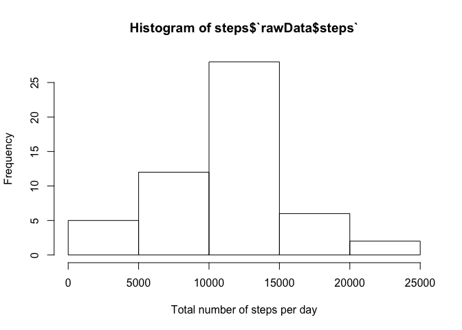
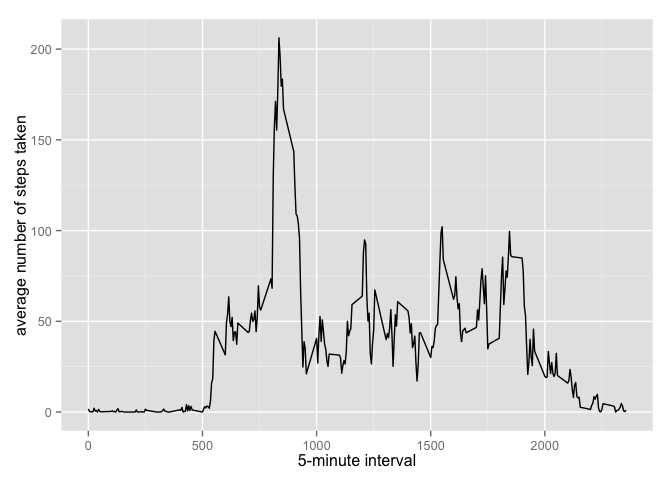
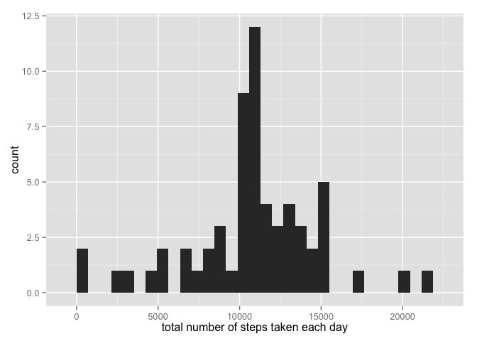

# Reproducible Research: Peer Assessment 1

## Loading and preprocessing the data
1. Load the data

```r
rawData = read.csv("activity.csv", na.strings = "NA")
```

2. Converting dates

```r
rawData$formatDate = as.Date(rawData$date,"%Y-%m-%d")
```
## What is mean total number of steps taken per day?

1. Calculating total number of steps per day

```r
steps = aggregate(rawData$steps ~ rawData$formatDate, FUN = sum)
```

2. Histogram of the number of steps per day

```r
hist(steps$`rawData$steps`,xlab = "Total number of steps per day",ylab = "Frequency")
```

 
3. Mean and median of the total number of steps per day

```r
meanSteps = mean(steps$`rawData$steps`)
medianSteps = median(steps$`rawData$steps`)
```
The mean of steps per day is: 1.0766189\times 10^{4}.  
The median of steps per day is: 10765.  

## What is the average daily activity pattern?

1. Now is shown a time series plot of the 5-minute interval (x-axis) and the average number of steps taken, averaged across all days.


```r
library(ggplot2)
```

```
## Warning: package 'ggplot2' was built under R version 3.1.3
```

```r
averages <- aggregate(x = list(steps = rawData$steps), by = list(interval = rawData$interval), FUN = mean, na.rm = TRUE)
ggplot(data = averages, aes(x = interval, y = steps)) + geom_line() + xlab("5-minute interval") + ylab("average number of steps taken")
```

 

2. Which 5-minute interval, on average across all the days in the dataset, contains the maximum number of steps?


```r
averages[which.max(averages$steps),]
```

```
##     interval    steps
## 104      835 206.1698
```

## Imputing missing values

1. Calculating and reporting the total number of missing values in the dataset 


```r
missing <- is.na(rawData$steps)
nMissing <- summary(missing)[3]
```

There are 2304 missing values.

2. Devising a strategy for filling in all of the missing values in the dataset. 

All of the missing values are filled in with mean value for that 5-minute interval.

3. Creating a new dataset that is equal to the original dataset but with the missing data filled in.

Here is the code to fill it.


```r
fill.value <- function(steps, interval) {
    filled <- NA
    if (!is.na(steps)) 
        filled <- c(steps) else filled <- (averages[averages$interval == interval, "steps"])
    return(filled)
}
filled.data <- rawData
filled.data$steps <- mapply(fill.value, filled.data$steps, filled.data$interval)
```

4. Make a histogram of the total number of steps taken each day and Calculate and report the mean and median total number of steps taken per day. Do these values differ from the estimates from the first part of the assignment? What is the impact of imputing missing data on the estimates of the total daily number of steps?

4.1. Calculating total number of steps per day


```r
steps = aggregate(filled.data$steps ~ rawData$formatDate, FUN = sum)
```

4.2. Histogram of the number of steps per day


```r
total.steps <- tapply(filled.data$steps, filled.data$date, FUN = sum)
qplot(total.steps, xlab = "total number of steps taken each day")
```

 

4.3. Mean and median of the total number of steps per day


```r
meanSteps = mean(total.steps)
medianSteps = median(total.steps)
```
The mean of steps per day is: 1.0766189\times 10^{4}.  
The median of steps per day is: 1.0766189\times 10^{4}.  


## Are there differences in activity patterns between weekdays and weekends?
